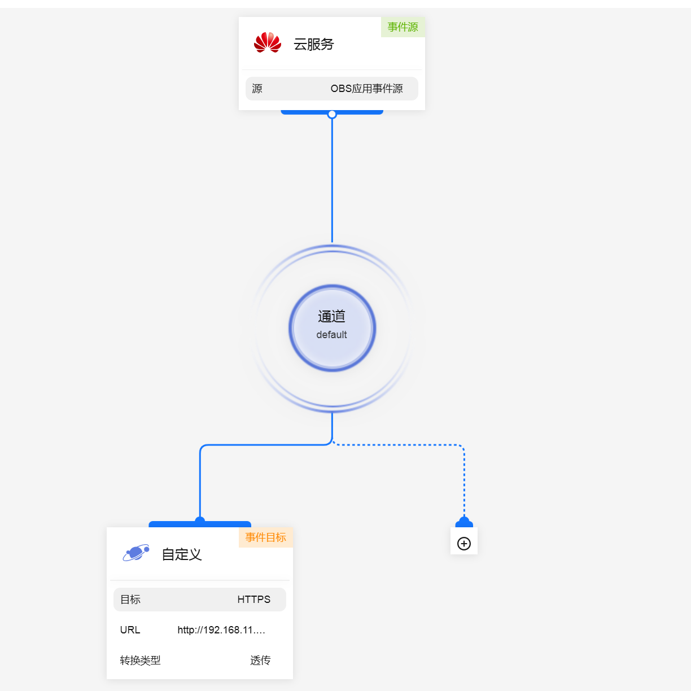
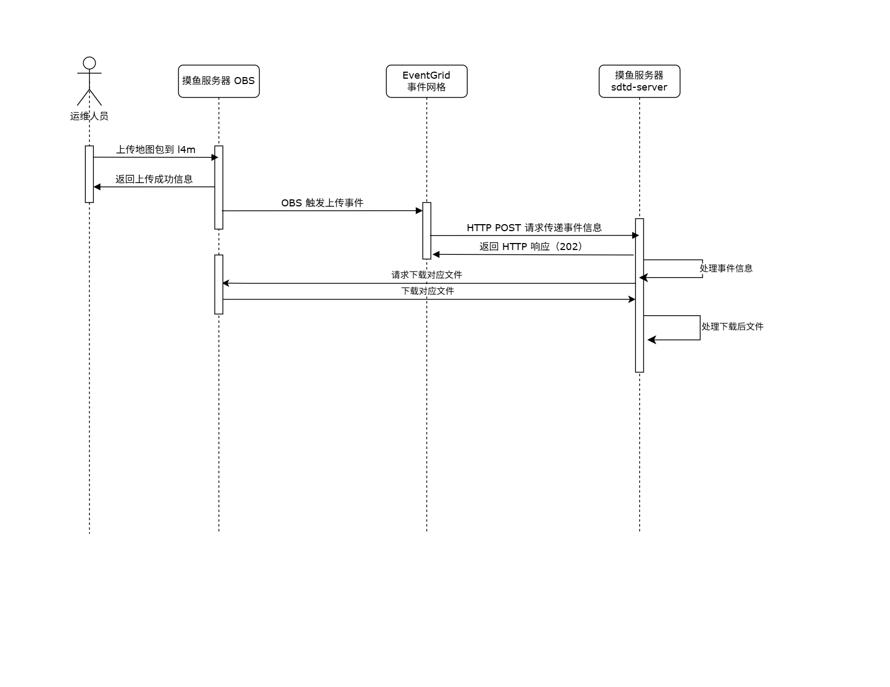

# 摸鱼服务器 OBS 监听

此应用基于 HuaweiCloud OBS 系统与 EG 事件网格进行

## 当前覆盖功能

### 功能需求

监听 OBS 上传求生文件，上传后自动拉取到服务器并进行解压处理

### 非功能需求

1. 小并发场景下的非阻塞响应、相同文件请求响应
2. 压缩包后缀与文件头不一致场景的纠错处理
3. 日志打印方式与 service 服务化（需自行编写 Linux 下的 service 文件）

## 前提需求

1. 须在 EG 处设置 OBS 配置事件订阅，如下图所示，事件源选择 OBS，类型可选择覆盖的事件，如创建对象注意大文件会分段上传，此时需包括
   OBS:DWR:ObjectCreated:CompleteMultipartUpload 事件
   
2. 若需要内网访问，则需提前在目标连接中创建对应的网络接口
3. 需要提前配置好 obsutil 相关操作，所有的与 OBS 交互的部分都由此工具进行

## 运行原理

配置完成 EG 后，当上传文件到 OBS 后，会向预定的自定义接口发送一条 POST 请求，本项目主要负责处理该请求携带的文件，可参考时序图



PS: 图中部分参数为当前实际使用参数

## 运行说明

需要在 config 目录下创建一个 config.yaml 文件，格式如下：

```yaml
l4d2server:
  obs_bucket: 'OBS 桶名称'
  addons_path: '存放最终 VPK 的目录'
  temp_path: '存放 OBS 下载文件的临时目录'
```
